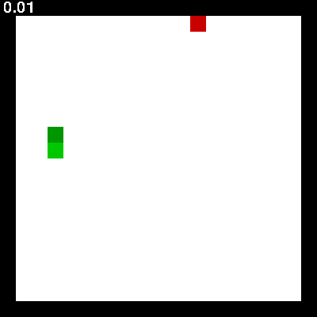
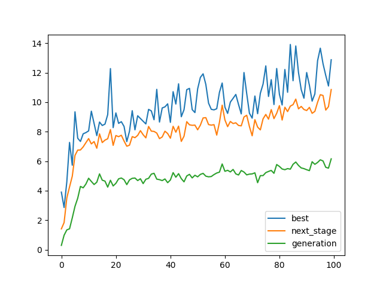
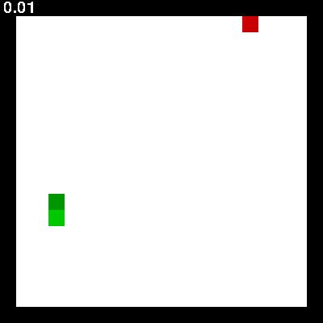
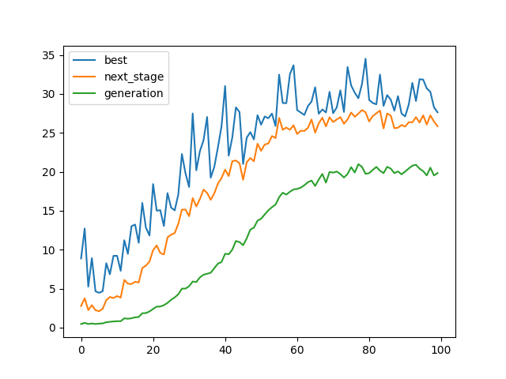
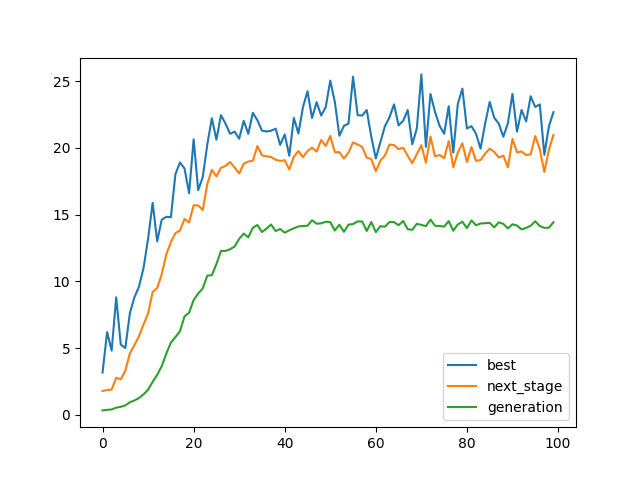
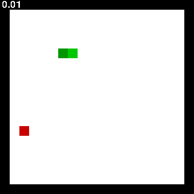
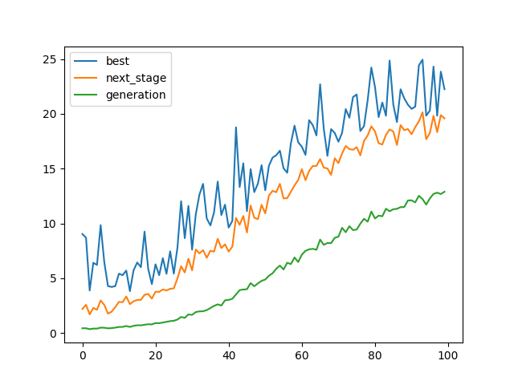
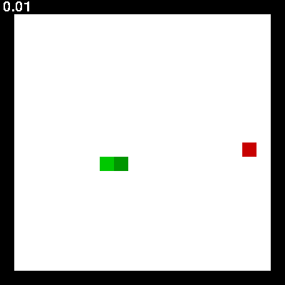
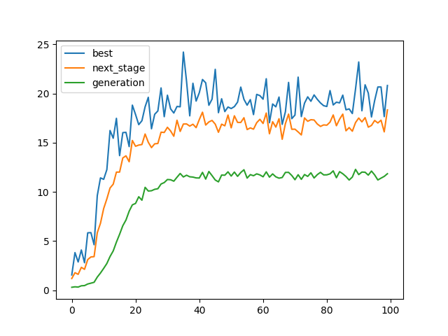

# big_brain_snake

## snake game controlled by neural network trained with genetic (and biological) algorithms

### by [michlampert](http://github.com/michlampert) & [WojtAcht](http://github.com/WojtAcht) & [tmek1244](http://github.com/tmek1244)

#### Written in python, with numpy and cython features

`pip install -r requirements.txt` to install Python modules

`py setup.py build_ext --inplace` for compile map_distance module

create directory to save best brains

run `py main.py` and relax

## genetic algorithm

|  |  |
| -- | -- |
|    first implementation   4x18 input neurons   each generation - 1024 snakes| |
|    second implementation   12 input neurons with symmetry   each generation - 100 snakes | |
|    second implementation   12 input neurons with symmetry   each generation - 100 snakes   crossing with mean of two genes| |
|    fourth implementation   12 input neurons with symmetry   each generation - 100 snakes | |

## PSO algorithm

|  |  |
| -- | -- |
|    12 input neurons with symmetry   each generation - 100 snakes   w=0.1   c2=0.1|  |
|    12 input neurons with symmetry   each generation - 100 snakes   w=0.05   c2=0.2 |  |
|    12 input neurons with symmetry   each generation - 100 snakes   w=0.2   c2=0.05 |  |
|    12 input neurons with symmetry   each generation - 100 snakes   w=0.1   c2=0.05 |  |

## Human and random input

|  |  |
| -- | -- |
| snake with human input    | snake with random moves    |

## PSO algorithm

|  |  |  |  |
| -- | -- | -- | -- |
|  |  |
|  |  |
|  |  |
|  |  |

