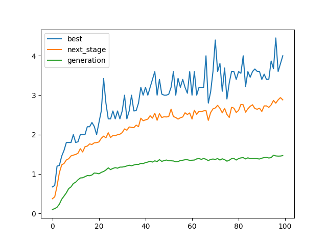

# big_brain_snake

## snake game controlled by neural network trained with genetic (and biological) algorithms

### by [tmek1244](http://github.com/tmek1244) & [WojtAcht](http://github.com/WojtAcht) & [michlampert](http://github.com/michlampert)

| snake with human input    | snake with random moves    |
| -- | -- |
|    first implementation   4x18 input neurons   each generation - 1024 snakes| |
|    second implementation   12 input neurons with symmetry   each generation - 100 snakes | |
|    fourth implementation   12 input neurons with symmetry   each generation - 100 snakes | |
